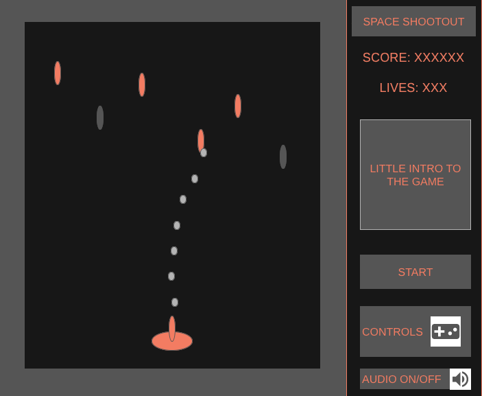
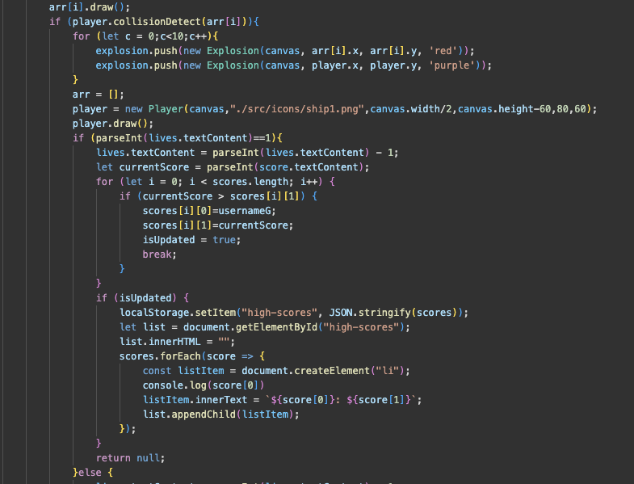

# JavaScript Space Shootout
## Background

JavaScript Space Shootout is an action-packed gaming project built entirely in JavaScript, Take a deep dive into the space where you take control of your spaceship to start shooting and dodging the obstacles and enemies that you encounter.

Game link:  [SpaceShootOut](https://jsingh0507.github.io/SpaceShootoutJS/)

## Functionality & MVPs
In JavaScript Space Shootout, users will be able to:
- Ship movement and controls:
    1) Implementation of smooth and responsive controls for the spaceship to precisly move around the space.
    2) Includes features such as keyboard and mouse input to control the spaceship, with option to choose the desired controller. 
- Obstacle Generation and Collision Detection:
    1) Generate a variety of obstacles including asteroids, enemy ships, and debris.
    2) Implementation of a collison detect system that allows the user to see realistic effect of the gameplay, including damages and destroction upon contact.
- Level Progression and Difficulty Scaling:
    1) Implemantation of a progression system that can increase the difficulty of the gameplay as the player gradually advances.
    2) Implementation of a scoring system that keep tracks of the current score and past highest scores(leaderboard).
- Visual and Audio Effects:
    1) Enhance user expirience with game backgound, and appleiang visuall effects.
    2) Include immersive audio exprience for the user with option to turn on/off.

## In addition, this project will include
- Controls:
    1) The user will be able to control the spaceship through the mouse or keyboard.
    2) Mouse: move the mouse to move the spaceship and press left button to shoot.
    3) Keyboard: move the spaceship by pressing the arrows keys and press the space to shoot.
- Scoring storage:
    1) To store the scores I plan to implement the browser local storage at first.
    2) If succefully implemented the above features, will implement Firebase cloud databse for scoring system.

## Wireframe

## Technologies, Libraries, APIs
Dillinger uses a number of open source projects to work properly:

- HTML - provides the structure of the game user's interface, inluding elements like buttons, texts, and canvases.
- CSS - used to style game's user interface, including colors, fonts, layouts, and animations.
- JavaScript - JavaScript is the core language used to implement the game logic, including player controls, enemy behavior, scoring, collision detection, and more. This will includes the use of classes, modules, and event handling,etc.
- Canvas API - The HTML <canvas> element and its JavaScript Canvas API provide a powerful way to draw graphics dynamically on a web page.This will be used to render the game's visuals, inluding the player's spaceship, enemies, asteroids, obstacles, and game background.
- Version Control System - for this Git will be used to keep track and save the progress of project development.
-  IDE: - for Integrated Development Environment will use Visual Studio Code.
- Local Storage/Firebase  - for string data into the backend will use the local storage of the browser then try to implement the Google firebase databse without the need to create a local backend database.

## Implementation Timeline
- Friday Afternoon & Weekend:
    1) Research and familiarize with game development in javascript.
    2) Setup a project board to keep track of progress.
    3) Brainstorm ideas, and different ways to approach, and install neccesaries packages.
    4) Create a basic project structure: set up HTML, CSS, and JavaScript files.
    5) Implement basic game mechanics such as player movement and shooting using JavaScript.
- Monday:
    1) Set up a simple game loop to handle game updates and rendering.
    2) Begin working on collision detection between the player's spaceship and obstacles/enemies.
    3) Design and create sprites or graphics for the player's spaceship, enemies, projectiles, and background scenery.
- Tuesday:
    1) Integrate graphics into the game using the Canvas API or a game development framework
    2) Design and implement the game's user interface elements using HTML and CSS.
    3) Display player score, remaining lives, and any other relevant information on the screen.
- Wednesday:
    1) Add controls for player input (keyboard and mouse controls).
    2) Debug and fine-tune the game mechanics, visuals, and user interface elements.
    3) Conduct thorough testing to identify and fix any bugs or issues.
    4) Write documentation for the project, including a README file with instructions on how to play the game, controls, and any other relevant information.
- Thursday Morning:
    1) Deploy.

## Code snippet

The above snippet is the code that includes the logic to update the score and keep track of the high score. This was one of the part were it took most of the time to come up with the logic to implement it. After doin some research I was able to implement the local storage to keep track and save the scores in the local browser for each player.